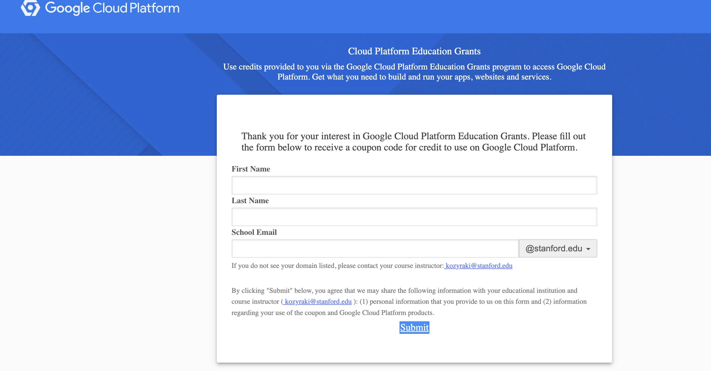
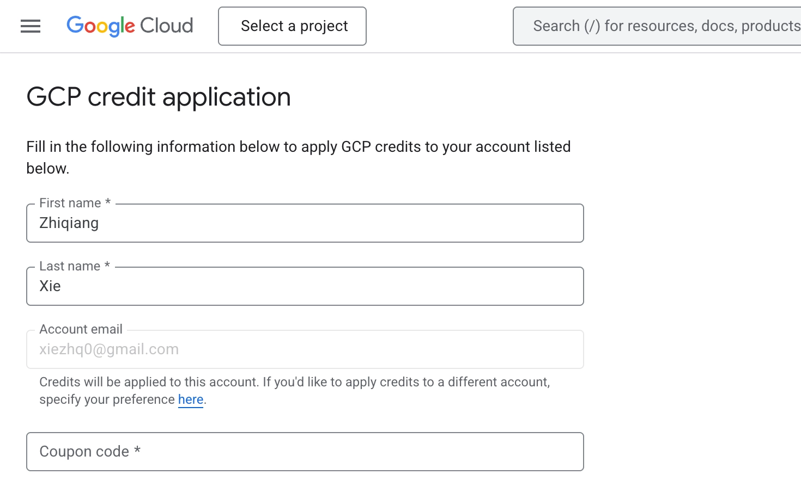
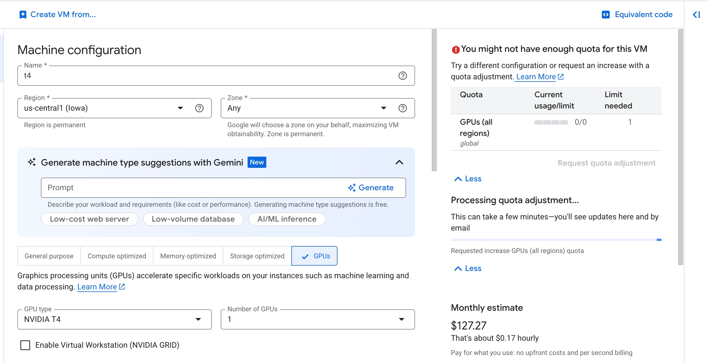

# Setting Up a GCP VM with GPU

## Step 1: Claim your GCP Education Credits

Go to the coupon retrieval page and fill in your name and school email:

**Coupon request link:** https://gcp.secure.force.com/GCPEDU?cid=uux3Hqhg5gw72jUo2afeGBrKmtVmmk9Pko70Zpjren3HkwerIBnW%2FVP4av8adauz/

## Step 2: Apply the Credits

Go to the GCP credit application page and enter the coupon code you received:

**Credit application page:** https://console.cloud.google.com/education

## Step 3: Create a VM with GPU

Create a VM instance with the following configuration:

- **Region:** us-central1 (Iowa)
- **Zone:** Any
- **GPU type:** NVIDIA T4
- **Number of GPUs:** 1

> **Note:** You may need to request a GPU quota increase (GPUs all regions: 0/0 → 1). This is processed automatically and takes a few minutes.

